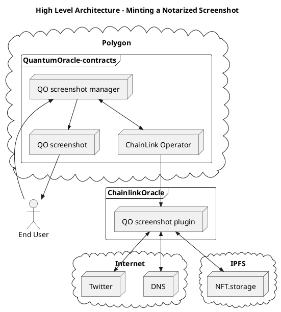

```plantuml
@startuml QuantumOracle High Level Architecture

title High Level Architecture - Minting a Notarized Screenshot

actor "End User" as eu

cloud Polygon {
    frame QuantumOracle-contracts{
        node "QO screenshot manager" as screenshot_manager
        node "QO screenshot" as screenshot
        node "ChainLink Operator" as operator
    }
}

frame ChainlinkOracle {
    node "QO screenshot plugin" as plugin
}

cloud Internet {
    node "DNS" as dns
    node "Twitter" as twitter
}

cloud IPFS {
    node "NFT.storage" as nft_storage
}

eu -->> screenshot_manager
screenshot_manager <<-->> operator
screenshot_manager -->> screenshot
screenshot -->> eu
operator -->> plugin
plugin <<-->> dns
plugin <<-->> twitter
plugin <<-->> nft_storage
@enduml
```
